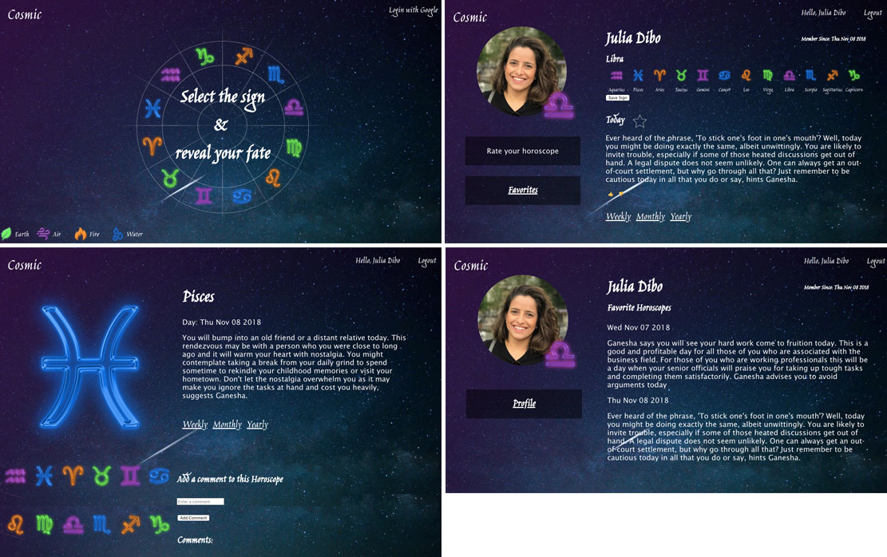

# Cosmic 

## Description
An app to check horoscope and favorite the ones you like the most.
The user can comment and rate the accuracy of the horoscope.
A group project built by Dilyara Yussupova, Jacqueline Saplicki, Julia Dibo and Ryan Archambault.

## Screenshot

## Technologies Used
 * HTML
 * CSS
 * Javascript
 * Node.js
 * Heroku
 * API - [Astrology](http://horoscope-api.herokuapp.com/)
 * Mongoose
 * MongoDB
 * Express.js
 * OAuth (Google)

 ## API Endpoints

 | HTTP method | Endpoint | CRUD |
| ------------ |:-------------:| -----:|
| GET | /horoscopes | getAllHoroscopes |
| GET | /horoscopes/:id' | getOneHoroscope |
| GET | /horoscopes/:date' | getHoroscopeByDate |

 ## Links
 * [Trello](https://trello.com/b/ZS371KkO/project-3)
 * [Pitch Deck](https://docs.google.com/presentation/d/10dXU2MZpfmny6LKK1wQliPGXkqTMdtowTK_K8pgyKeI/edit?usp=sharing)
 * Check your horoscope - [Cosmic](https://cosmic-zodiac.herokuapp.com/) 

## Future features (ice box)
 * Opt-in to receive a daily horoscope SMS or E-mail.
 * Upgrade to a more complete API
 * Remove "Ganesha says"
 * See other user profile 
 * Share your horoscope
